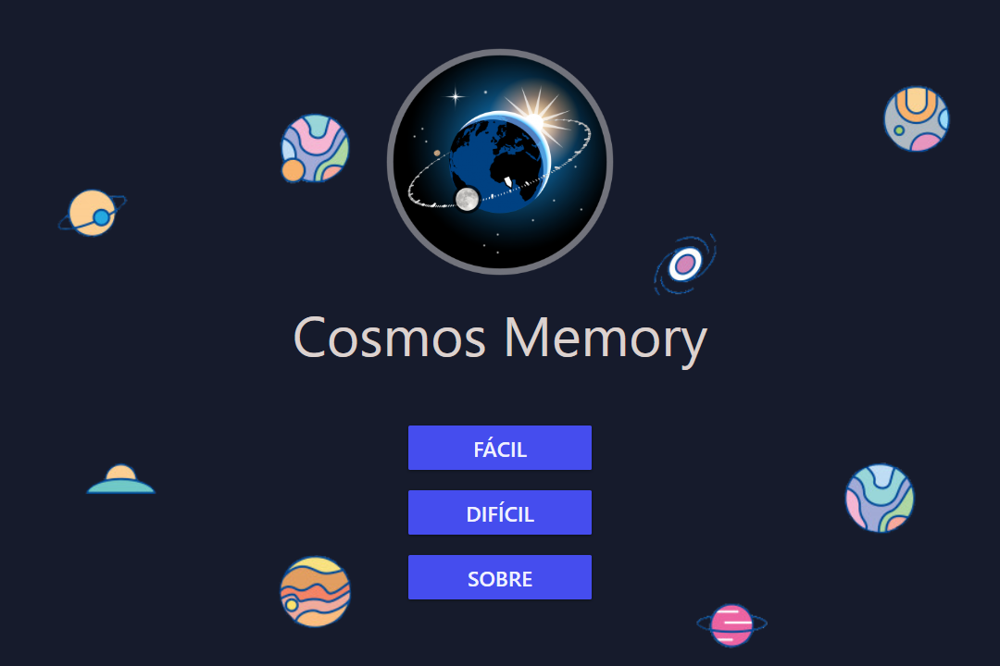
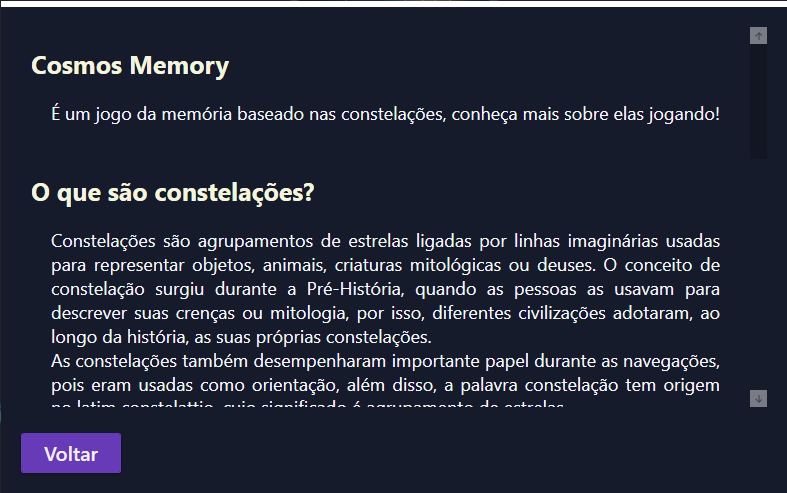
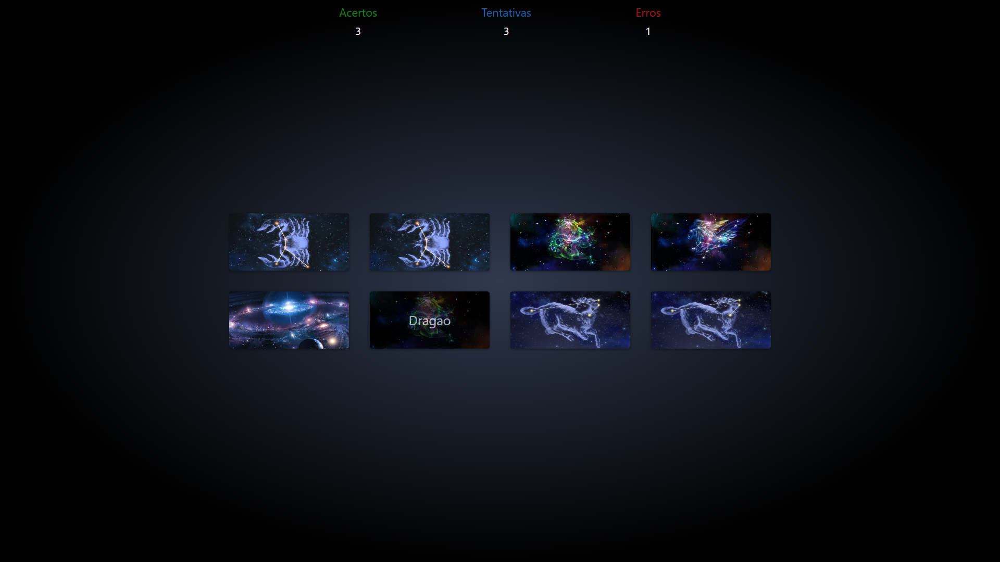
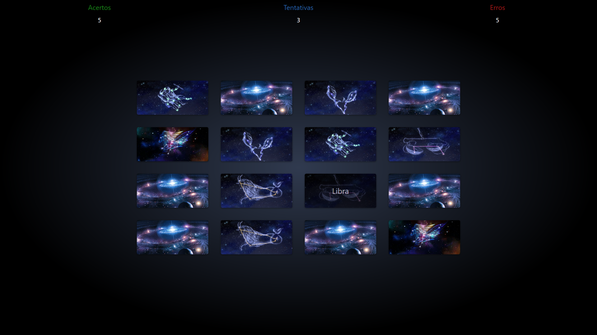

# Falco Game Platform

  
  
  
  
  
  
  
  
  

Plataforma de jogos educacionais

<h2 align="center">Cosmos Memory</h2>

<h4 align="center">Tela Inicial</h4>

   
    Escolha um modo de jogo ou aprenda mais clicando em sobre

  

***

<h4 align="center">Tela Sobre</h4>

   
    Aqui pode ler mais sobre o jogo e aprender sobre as contelações

  

***

<h4 align="center">Jogo no Fácil</h4>

   
     No fácil temos apenas 8 cartas (4 pares),
     mas tome cuidado, pois o número de tentativas é limitado ao número de pares!

  

***

<h4 align="center">Jogo no Difícil</h4>

   
    No difícil além das tenativas limitadas,
    temos 16 cartas (8 pares) sendo necessario maior atenção para não errar!

  
